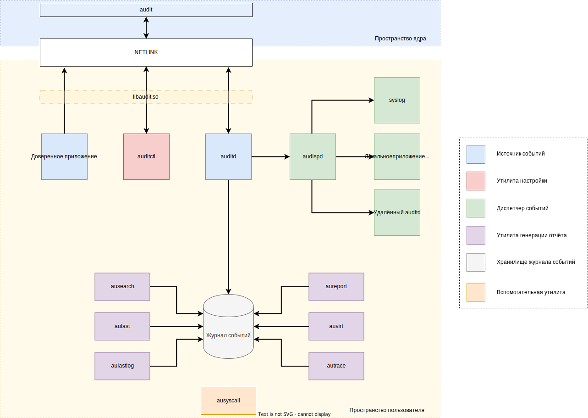

= linux audit notes
:hardbreaks-option:
:sectlinks:

== Архитектура

Система аудита состоит из 2-х частей: фреймворка, работающего в ядре и userspace-приложений.

Фреймворк задействован для агрегации сообщений аудита от разных источников событий и слежения за системными вызовами ядра.

Userspace-приложения используются для настройки фреймворка и выгрузки из него событий аудита для их дальнейшей обработки.

Источники событий бывают следующими:

Постоянный источник событий, называемый доверенным приложением - программа или библиотека, которая отправляет различные события безопасности фреймворку аудита. Примерами таких программ и библиотек выступают `login`, `sshd`, `sudo`, `useradd`, `librpm.so`, `libpam.so` - они специально пропатчены для работы с системой аудита и всегда отправляют сообщения безопасности в процессе своей работы в системе. Например: при локальной/удалённой аутентификации пользователя, повышении привилегий процесса, удалении пользователя или группы, установке RPM-пакета и так далее. Фреймворк принимает событие от доверенного приложения, обогащает его меткой времени и информацией об отправителе, и затем помещает сообщение аудита в очередь событий.

Настраиваемый источник событий - заданные администратором системы правила аудита, которые описывают условия записи или игнорирования событий в зависимости от списков, в которые эти правила занесены. Всего определено 5 списков-хуков:

`task, exit` - для правил слежения за системными вызовами ядра и обращениями к файлам и каталогам;
`user` - для исключения событий от источников, работающих в пространстве пользователя;
`exclude` - для исключения заданных типов событий, например, для исключения AVC-denial сообщений от не настроенного SELinux;
`filesystem` - для исключения событий от файловой системы целиком.

Слежение за системными вызовами ядра реализовано следующим образом - во время исполнения сискола ядро сверяет условия правила аудита и атрибуты запросившей системный вызов программы. Атрибутами могут выступать UID/GID пользователя, имя исполняемого файла, идентификатор сессии вошедшего в систему пользователя и т. д. При полном соответствии атрибутов программы и условий проверяемого правила, фреймворк генерирует сообщение аудита с включенной информацией об инициаторе действия; навешивает на сообщение метку времени и помещает сообщение в очередь событий.

Утилита **auditctl** используется для настройки системы аудита - её включения/выключения, проверки статуса работы, загрузки/выгрузки правил аудита.

Демон **auditd** опрашивает фреймворк на наличие новых данных в очереди событий и в случае их появления выполняет следующие действия:

записывает событие в локальный журнал;
передаёт событие диспетчеру audisp;

Локальный журнал событий это обычный текстовый файл. Для работы с ним доступны следующие утилиты:

**ausearch** используется для выборочного отображения событий аудита в соответствие с заданными фильтрами. Рекомендуется использовать данную утилиту при повседневной работе с журналом событий так как она позволяет группировать записи в одно целое событие, выводить события в разных форматах, искать события с применением фильтров по атрибутам;
**aureport** используется для вывода суммарных отчётов по различным типам имеющихся событий;
**aulast** и **aulastlog** используются для вывода информации о пользовательских сессиях;
autrace является утилитой для трассировки программ, при которой информация об используемых в программе системных вызовах записывается в журнал в виде событий аудита;
**auvirt** используется для вывода информации, связанной с работой виртуальных машин (KVM).

Диспетчер audisp принимает события от auditd и передаёт их внешним приёмникам событий используя систему плагинов. Например: syslog-коллектору, сервису auditd на другом хосте, в IDS/SIEM.

Вспомогательная утилита **ausyscall** выводит информацию о системных вызовах в системе, в которой была запущена.