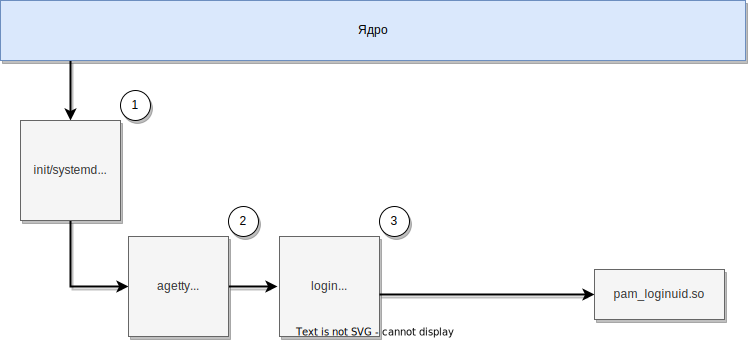
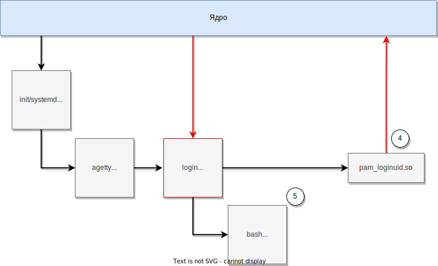
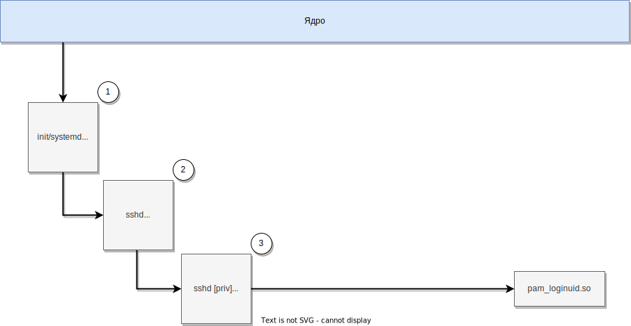
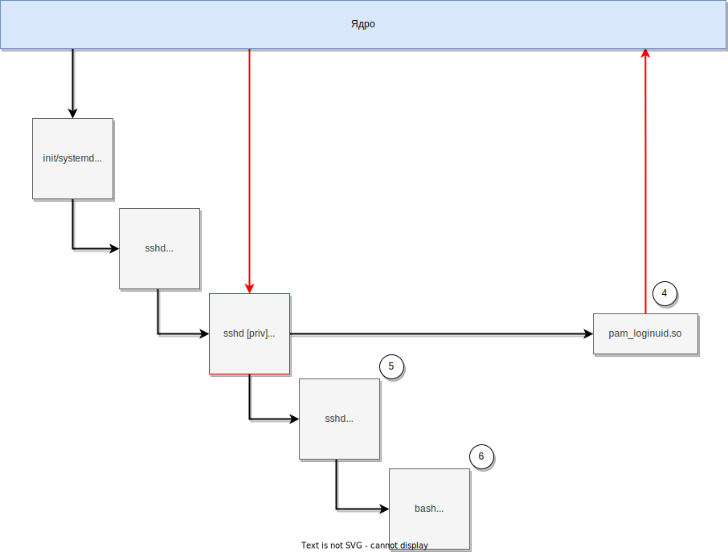
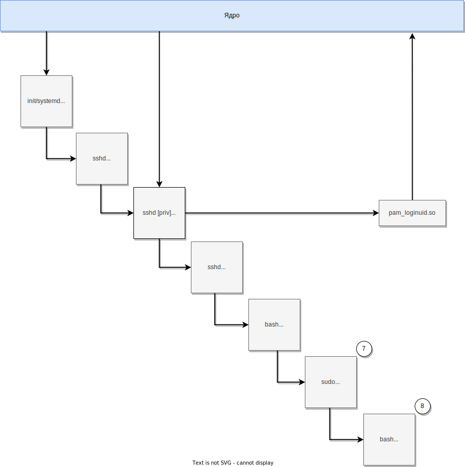

= xref:index.html[linux audit notes]
:table-caption: Таблица
:figure-caption: Изображение
:hardbreaks-option:
:sectlinks:

== loginuid и sessionid
`loginuid` и `sessionid` - идентификаторы, применяемые системой аудита для отслеживания пользователя с момента его входа в систему. Данные идентификаторы являются https://elixir.bootlin.com/linux/v3.10.108/source/include/linux/sched.h#L1239[полями структуры task_struct] и поэтому присутствуют в любом запущенном процессе системы. Посмотреть значение `loginuid` можно командой `cat /proc/PID/loginuid`; значение `sessionid` командой `cat /proc/PID/sessionid`.

При загрузке ОС, процессу инициализации init/systemd (PID 1) назначается `loginuid` равный `-1`. `loginuid` наследуется от процесса-родителя и поэтому все дочерние процессы, в том числе запускаемые сервисы, также будут иметь `loginuid` равным `-1`. После прохождения пользователем аутентификации в системе, в идентификатор `loginuid` с помощью модуля `pam_loginuid.so` записывается его [пользователя] UID, что позволяет:

. определить, какие процессы были запущены вошедшим в систему пользователем;
. определить, под каким изначально логином пользователь вошёл в систему, даже если он повысил свои права с помощью команд `sudo`/`su`.

Если разрешён вход локальным root'ом, то после входа рута, `loginuid` всех запущенных суперпользователем процессов всегда будет равен `0`.

Указание загрузить модуль аутентификации `pam_loginuid.so` для приложений, отвечающих за вход в систему (login, sshd и т. д.), отражено в конфигурации PAM:

```
# cat /etc/pam.d/login 
[...]
session    required     pam_loginuid.so
[...]

# cat /etc/pam.d/sshd
[...]
session    required    pam_loginuid.so
[...]
```

Идентификатор `sessionid` используется для различения сессий одного и того же пользователя, работающего в нескольких сеансах. В процессе записи идентификатора `loginuid` система аудита также присваивает идентификатору `sessionid` номер новой сессии, взятый https://elixir.bootlin.com/linux/v3.10.108/source/kernel/auditsc.c#L1998[путём инкремента] https://elixir.bootlin.com/linux/v3.10.108/source/kernel/auditsc.c#L1974[глобального счётчика сессий].

В событиях аудита поля, отражающие идентификаторы `loginuid` и `sessionid`, носят имена `auid` и `ses` соответственно.

== Отслеживание локального входа пользователя в систему
.Отслеживание локального входа пользователя в систему
[cols="0,6,1,1,1,1"]
|===
|#|Действие|Процесс|EUID|loginuid|sessionid

|1|Запуск процесса init/systemd при загрузке ОС.|init/systemd|0|-1|-1
|2|Запуск процессом init/systemd дочернего процесса agetty, ожидающего ввод логина пользователя.|agetty|0|-1|-1
|3|Замена процесса agetty процессом login после ввода имени пользователя. Аутентификация пользователя процессом login.|login|0|-1|-1
|4|После успешного прохождения аутентификации: запись в loginuid значения UID вошедшего в систему пользователя модулем pam_loginuid.|login|0|1001|1
|5|Запуск процессом login командной оболочки bash с UID пользователя и унаследованным loginuid.|bash|1001|1001|1
|6|Запуск команды sudo пользователем.|sudo|0|1001|1
|7|Запуск процессом sudo нового экземпляра командной оболочки bash, выполняющейся с правами суперпользователя. Эффективный UID (EUID) = 0 (root). loginuid и sessionid унаследованы.|bash|0|1001|1
|===

.Шаги 1-3 из таблицы выше


.Шаги 4-5 из таблицы выше


.Шаги 6-7 из таблицы выше
image:linux-audit-login-local-bash-privesc.svg[link="linux-audit-login-local-bash-privesc.svg"]

== Отслеживание удалённого входа непривилегированного пользователя
Сервер sshd из проекта OpenSSH использует https://www.citi.umich.edu/u/provos/papers/privsep.pdf[механизм разделения привилегий], при котором за операции сетевого взаимодействия с пользователем и его аутентификацию отвечают отдельные процессы sshd с разным набором прав доступа. В данном разделе приводится описание компонента sshd monitor (sshd [priv]), непосредственно отвечающего за аутентификацию пользователя с помощью PAM-стека и генерирующего события аудита, и не приводится описание компонента sshd slave (sshd [net]), отвечающего за сетевое взаимодействие с недоверенным источником подключения.

.Отслеживание удалённого входа непривилегированного пользователя в систему
[cols="0,6,1,0,0,0"]
|===
|#|Действие|Процесс|EUID|loginuid|sessionid

|1|Запуск процесса init/systemd при загрузке ОС.|init/systemd|0|-1|-1
|2|Запуск процессом init/systemd процесса sshd, ожидающего подключения.|sshd|0|-1|-1
|3|Запуск процессом sshd дочернего процесса sshd [priv]. Аутентификации пользователя процессом sshd [priv].|sshd [priv]|0|-1|-1
|4|После успешного прохождения аутентификации: запись в loginuid значения UID вошедшего в систему пользователя модулем pam_loginuid.|sshd [priv]|0|1002|2
|5|Запуск процессом sshd [priv] дочернего процесса sshd для новой сессии (user@pts/1) вошедшего в систему пользователя.|sshd|1002|1002|2
|6|Запуск процессом sshd командной оболочки bash.|bash|1002|1002|2
|7|Запуск пользователем команды sudo в bash.|sudo|0|1002|2
|8|Запуск процессом sudo нового экземпляра командной оболочки bash, выполняющейся с правами суперпользователя. Эффективный UID (EUID) = 0 (root). loginuid и sessionid унаследованы.|bash|0|1002|2
|===


.Шаги 1-3 из таблицы выше


.Шаги 4-6 из таблицы выше


.Шаги 7-8 из таблицы выше
